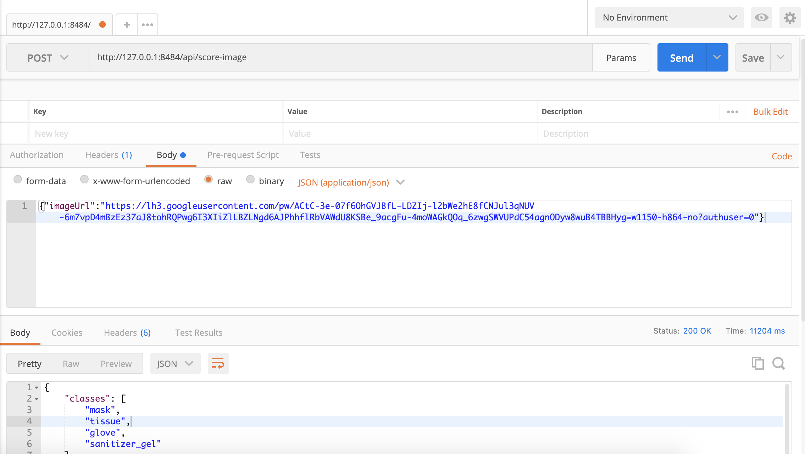

# Notes

## Run  

The API is wrapped up in a Dockerfile to make it easier to run.
Before running the Dockerfile which can be found in the `docker_files` folder.

Do the following inside the `docker_files` folder :  

1- Create a `weights` folder and load the model weights in it. => [Weights file](https://drive.google.com/file/d/1Y4YeSB3mQ0PN9zuAdSPKtPV1jNpYa_IX/view?usp=sharing)

2- Install docker if you don't have it. Then type in your terminal:

```sh
# Command to build the Dockerfile
docker build --rm . -t your_user_name/detectron2:cleanout_v0
# Command to run the Dockerfile
docker run -p 8484:5000 -it your_user_name/detectron2:cleanout_v0 bin/bas
```

3- Use Postman and fill the `POST` with the following address: `http://127.0.0.1:8484/api/score-image`


## Client part

Run the following in your terminal:

```sh
npm install
npm install -g browserify
npm install -g watchify
npm i konva
npm i xhr-request
watchify index.js -o bundle.js
```

After this click on `index.html` to visualize the results.

**NB:**
I run the docker in parallel for now until I deploy the API.
Remember to type `docker run -p 8484:5000 -it your_user_name/detectron2:cleanout_v0 bin/bas` to do so.
Also, notice that some websites hosting images have a bit strict CORS policies so not all images will work fine. But you can check out the response using the inspectore `console` section.

## Resources

[Reference on which this work is based upon.](https://towardsdatascience.com/detectron2-the-basic-end-to-end-tutorial-5ac90e2f90e3)
