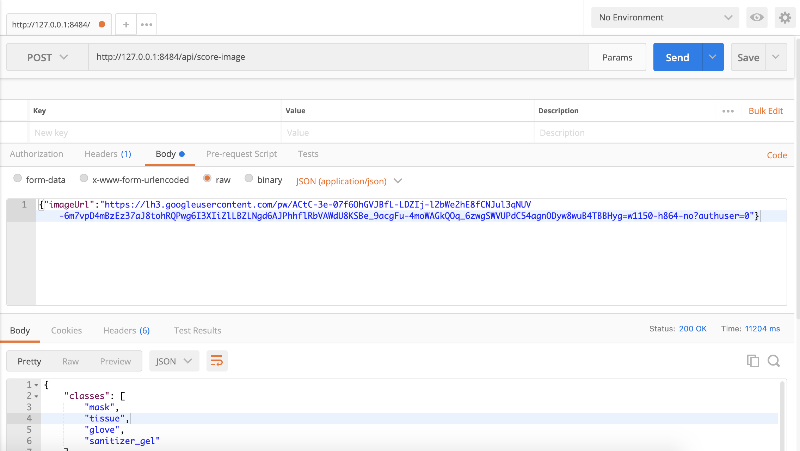

# CleanOut AI API Quickstart

## Before you start

Make sure you meet the following prerequisites before starting the tutorial steps:

* Familar with Python Docker and Deep learning (instance segmentation)
* Docker and Docker Hub
* Deep learning (instance segmentation)
* Azure App Service

## Get started

### Deploy your own docker file

#### Step 1 - Push the docker file to Docker Hub

#### Test your docker file

Test locally if everything is working as it should before pushing your docker file.

The API is wrapped up in a Dockerfile to make it easier to run.
Before running the Dockerfile which can be found in the `docker_files` folder.

Do the following inside the `docker_files` folder :  

1- Install [docker](https://docs.docker.com/get-docker/) if you don't have it
2- Create a [Docker Hub](https://hub.docker.com/) account
3- Type in your terminal:

```sh
# Command to build the Dockerfile
docker build --rm . -t your_dockerhub_id/detectron2:cleanout_v0
# Command to run the Dockerfile
docker run -p 8484:5000 -it your_dockerhub_id/detectron2:cleanout_v0 bin/bas
```

For the headers please use:
**Key:** Content-Type
**Value:** application/json

4- Use Postman and fill the `POST` with the following address: `http://127.0.0.1:8484/api/score-image`


#### Push your docker file to Docker Hub

1- List all the docker images in your system
2- Get the tag of the docker you want to deploy
3- Log In to your Docker Hub account
4- Push the docker to Docker Hub

```sh
# Get the docker tag
docker images
# Tag your docker
docker tag your_docker_tag your_dockerhub_id/detectron2:cleanout_v0
# Log In to your Docker Hub account
docker login --username=your_dockerhub_id --password=your_dockerhub_password
# Push your docker
docker push your_dockerhub_id/detectron2:cleanout_v0
````

#### Step 2 - Deploy the docker file as an app in Azure

1- Go to [App Services](https://portal.azure.com/#blade/HubsExtension/BrowseResource/resourceType/Microsoft.Web%2Fsites) in your Azure account
2- Click on Add
3- In the [Create Web App](https://portal.azure.com/#create/Microsoft.WebSite) section, fill in the:
* **Project Details**  
    * Subscription  
    * Resource Group  

* **Instance Details**  
    * Name  
    * Publish => `Docker Container`  
    * Operationg system => `Linux`  
4- Click on `Next Docker`


5- Fill in:
* Options => `Single Docker` 
* Image Source => `Docker Hub`
* **Docker hub options**
    * Access Type => `Public`
    * Image and tag => `your_dockerhub_id/detectron2:cleanout_v0`
    * Startup Command => `docker pull your_dockerhub_id/detectron2:cleanout_v0`
6- Click on `Review + create` and wait for it


You will be provided with the `https` link to your app which you can then use to consume the API in the same way as explained in the [Test your docker file](#test-your-docker-file) section by replacing the local address by the deployed https one.

### Use deployed docker file

#### Pull the docker file

- Type in CMD or Terminal : `docker pull khammami/detectron2:latest`
- You can test it by typing : `docker run -p 8484:5000 -it khammami/detectron2:latest bin/bas`
- Use postman to check if everything is working as it should like in [Test your docker file](#test-your-docker-file) section.

#### Deploy the docker to Azure

Follow the same steps as in [Step 2 - Deploy the docker file as an app in Azure](step-2-deploy-the-docker-file-as-an-app-in-azure). But remember to change the docker image to `khammami/detectron2:latest`. 

### Use the API directly

To use the API directly:

- Call this endpoint in your code

```sh
https://cleanout.azurewebsites.net/api/score-image
```

- Feed it a JSON request like this example

```sh
{"imageUrl" : "https://lh3.googleusercontent.com/pw/ACtC-3e-07f6OhGVJBfL-LDZIj-l2bWe2hE8fCNJul3qNUV-6m7vpD4mBzEz37aJ8tohRQPwg6I3XIiZlLBZLNgd6AJPhhflRbVAWdU8KSBe_9acgFu-4moWAGkQOq_6zwgSWVUPdC54agnODyw8wuB4TBBHyg=w1150-h864-no?authuser=0"}
```
For more information, please check the [cleanOut-api-reference file](https://github.com/BuildForSDGCohort2/Team-253-Group-A-Backend/blob/develop/ai_part/model_api/api-reference/cleanOut-api-reference.md).

