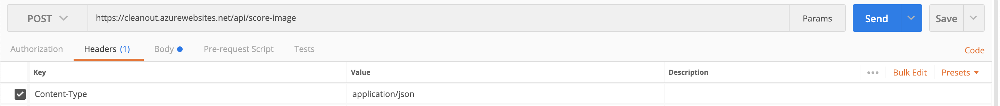
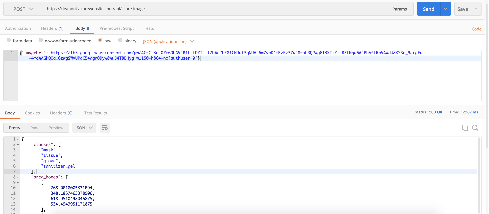

# CleanOut AI API

The CleanOut AI API lets you analyze an image and detect if it contains a mask, glove, tissue or gel sanitizer and gives the probability of each detected object.

## Service: cleanout.azurewebsites.net

### Service endpoint

A service endpoint is a base URL that specifies the network address of an API service. One service may have multiple service endpoints. This service has the following service endpoint and all URIs below are relative to this service endpoint:
    - https://cleanout.azurewebsites.net

## REST Resource:  

### Methods 

|[api/score-image](https://cleanout.azurewebsites.net/api/score-image)| 
|:-------------------|
|**POST /api/score-image**: Send an image in a JSON format to pass to the AI model.|

### Headers

**Key:** Content-Type
**Value:** application/json



### Example request 

```sh
{"imageUrl" : "https://lh3.googleusercontent.com/pw/ACtC-3e-07f6OhGVJBfL-LDZIj-l2bWe2hE8fCNJul3qNUV-6m7vpD4mBzEz37aJ8tohRQPwg6I3XIiZlLBZLNgd6AJPhhflRbVAWdU8KSBe_9acgFu-4moWAGkQOq_6zwgSWVUPdC54agnODyw8wuB4TBBHyg=w1150-h864-no?authuser=0"}
```

### Example response

```sh
{
    "classes": [
        "mask",
        "tissue",
        "glove",
        "sanitizer_gel"
    ],
    "pred_boxes": [
        [
            268.0018005371094,
            348.1837463378906,
            618.9510498046875,
            534.4949951171875
        ],
        [
            959.7051391601562,
            498.20269775390625,
            1035.62109375,
            543.8713989257812
        ],
        [
            814.401123046875,
            46.7968864440918,
            1073.419189453125,
            261.3951721191406
        ],
        [
            759.7879028320312,
            272.14154052734375,
            903.2980346679688,
            436.37567138671875
        ],
        [
            521.002197265625,
            247.9897003173828,
            653.2345581054688,
            302.86895751953125
        ],
        [
            621.1874389648438,
            382.9181823730469,
            753.0362548828125,
            461.0121765136719
        ],
        [
            461.8687744140625,
            234.53086853027344,
            508.47119140625,
            268.9863586425781
        ]
    ],
    "pred_classes": [
        0,
        0,
        0,
        0,
        0,
        0,
        0
    ],
    "scores": [
        0.9983308911323547,
        0.7829904556274414,
        0.7333208322525024,
        0.7124810814857483,
        0.70665442943573,
        0.6647731065750122,
        0.5768139958381653
    ]
}
```



## References

Inspired from : [API reference of various resource types](https://developers.google.com/gmail/api/v1/reference)